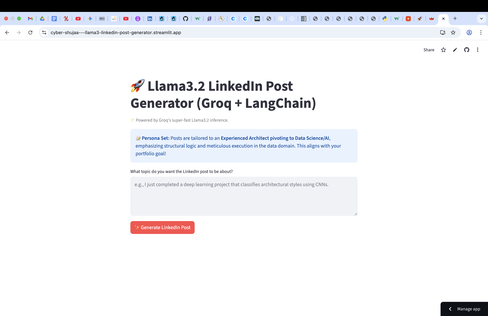

# 🕸️ Cyber Shujaa - Llama 3.1 LinkedIn Post Generator 🚀

## 🧭 Table of Contents

- [🔎 Project Overview](#🔎-project-overview)
- [🔗 Live Application and Demo](#🔗-live-application-and-demo)
- [🎯 Key Differentiator: Architect to Data Science Persona](#🎯-key-differentiator-architect-to-data-science-persona)
- [⚙️ Technology Stack](#⚙️-technology-stack)
- [🛠️ Installation and Setup](#🛠️-installation-and-setup)
- [▶️ How to Run the App](#▶️-how-to-run-the-app)
- [👩🏽‍💻 Author](#👩🏽‍💻-author)

## 🔎 Project Overview

This is an end-to-end Generative AI application built to generate highly optimized, professional LinkedIn posts. The unique value of this project is its use of a highly **customized System Prompt** to align every generated post with the author's personal brand: **An experienced Architect pivoting into Data Science and AI**.

The app demonstrates competence across the modern GenAI stack, from cloud-based LLM inference to a dynamic front-end.

## 🔗 Live Application and Demo

See the application in action and try it out yourself!

- **Live App Link:** [https://cyber-shujaa---llama3-linkedin-post-generator.streamlit.app/](https://cyber-shujaa---llama3-linkedin-post-generator.streamlit.app/)
- **Demo Screenshot:** 

## 🎯 Key Differentiator: Architect to Data Science Persona

The core logic utilizes advanced prompt engineering to ensure all generated content highlights the transferrable skills from architecture to data science, such as:

- **Structural Logic:** Designing robust data pipelines and ML systems.
- **Meticulous Execution:** Precision in project management and data quality control.
- **Abstract Problem-Solving:** Translating complex business problems into concrete, functional AI deliverables.

Every post includes a targeted call to action seeking entry-level Data/AI opportunities.

## ⚙️ Technology Stack

This project showcases an understanding of the following cutting-edge technologies:

| Component | Technology | Purpose |
| :--- | :--- | :--- |
| **LLM (Large Language Model)** | **Llama 3.1 8B Instant** | The open-source model used for generating high-quality text.|
| **Inference Engine** | **Groq Cloud** | Provides ultra-low latency, high-speed LLM inference, demonstrating performance optimization. |
| **Orchestration** | **LangChain** | Used for defining the processing chain (Prompt Template ➡️ LLM ➡️ Output Parser). |
| **Front-End/UI** | **Streamlit** | Transforms Python code into an interactive, shareable web application. |
| **Environment** | `python-dotenv`, `venv` | Best practices for secure API key management and dependency isolation. |

---

## 🛠️ Installation and Setup

Follow these steps to set up and run the project locally:

### 1. Clone the Repository

```bash
  git clone [GITHUB_REPO_URL]
  cd 'Cyber Shujaa - Llama3 LinkedIn Post Generator'
```

### 2. Create and Activate the Virtual Environment

It is highly recommended to use a virtual environment to manage dependencies.

```bash
  python -m venv venv

  # macOS/Linux:
  source venv/bin/activate

  # Windows (Command Prompt):
  venv\Scripts\activate
```

### 3. Install Dependencies

```bash
  pip install -r requirements.txt
```

### 4. Configure API Key

1. Obtain a **Groq API Key** from the Groq Developer Console.
2. Create a file named `.env` in the root directory.
3. Add your key inside the file:

```
  GROQ_API_KEY = "YOUR_GROQ_API_KEY_HERE"
```
*(Note: The `.env` file is excluded from version control by the `.gitignore`.)*

## ▶️ How to Run the App

Start the Streamlit application from your terminal:

```bash
  streamlit run app.py
```

The application will automatically open in your web browser, typically at `http://localhost:8501`.

## 📁 File Structure

```bash
  Cyber Shujaa - Llama3 LinkedIn Post Generator/
    ⎹⎯ app.py                   # Streamlit UI and main entry point.
    ⎹⎯ requirements.txt         # Lists all required Python packages.
    ⎹⎯ .env                     # Securely stores the Groq API Key (excluded by .gitignore).
    ⎹⎯ README.md                # Project documentation file.
    ⎹⎯ .gitignore               # Ignores venv and .env files for Git.
    ⎹⎯ src/
      ⎹⎯ llm_service.py         # Core LangChain setup, model selection (Llama 3.1) and prompt logic.
```

## 👩🏽‍💻 Author

| Platform | Link |
| :--- | :--- |
| **Portfolio Website** | https://grace-sampao.github.io/ |
| **LinkedIn** | [Grace Sampao](https://www.linkedin.com/in/grace-sampao) |
| **X** | [@grace_sampao](https://x.com/grace_sampao) |
| **Email** | sampaograce@gmail.com |

---